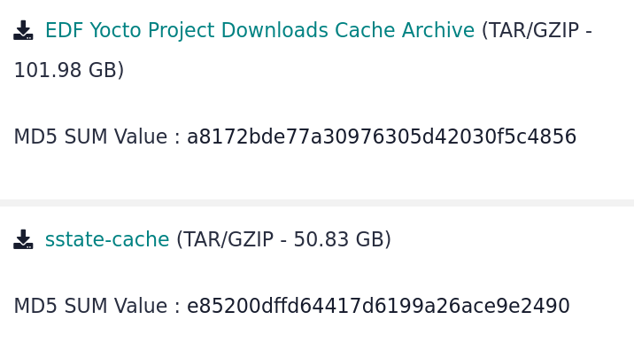
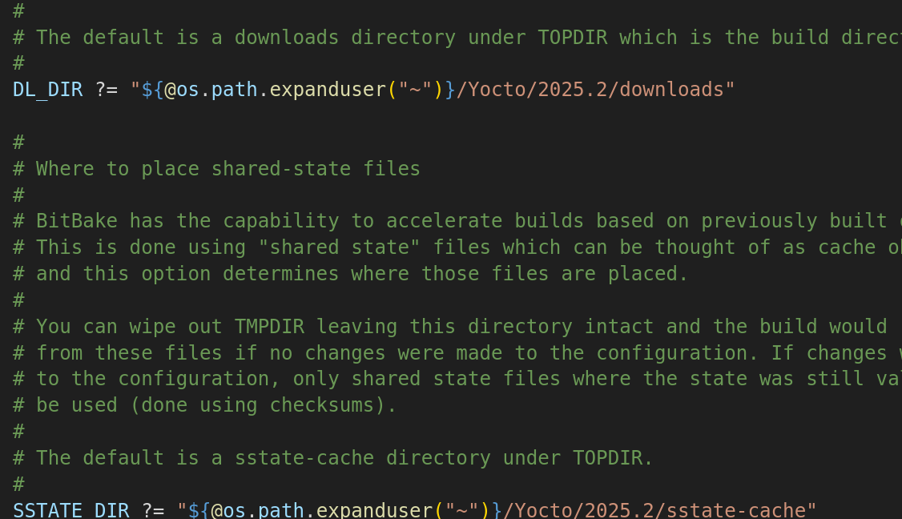

# PetaLinux-to-EDF-Demo
This project will *thoroughly* document transitioning a simple FPGA project from PetaLinux to the EDF (Yocto flow) **from start to finish**.

## Overview

- Project Version: 2025.2
- OS Version: Alma Linux 9.7
- Yocto Upstream Version: Scarthgap LTS (v5.0)
- FPGA: [ZCU104 Dev Board](https://www.amd.com/en/products/adaptive-socs-and-fpgas/evaluation-boards/zcu104.html)

## Installation

- Dependency Installs
    - `gsettings set org.gnome.desktop.wm.preferences button-layout ":minimize,maximize,close"`
    - `sudo dnf update`
    - `sudo dnf install epel-release dnf-plugins-core`
    - `sudo dnf config-manager --set-enabled crb`
    - `sudo dnf makecache`
    - `sudo dnf install autoconf automake bzip2 ccache chrpath cpio cpp diffstat diffutils gawk gcc gcc-c++ git glib2-devel glibc-devel glibc-langpack-en glibc-locale-source gzip latexmk libacl librsvg2-tools libtool lz4 make ncurses ncurses-devel openssl openssl-devel patch perl perl-Data-Dumper perl-Text-ParseWords perl-Thread-Queue python3 python3-GitPython python3-jinja2 python3-pexpect python3-pip repo rpcgen socat tar texinfo texlive-collection-fontsrecommended texlive-collection-latex texlive-collection-latexrecommended texlive-collection-xetex texlive-fncychap texlive-gnu-freefont texlive-tex-gyre texlive-xetex uboot-tools unzip wget which xterm xz zlib zlib-devel zstd`
    - `sudo pip3 install sphinx sphinx_rtd_theme pyyaml`
    - `localectl`
        - Locale should be set to "LANG=en_US.UTF-8"
        - In case if it's not: `sudo localectl set-locale LANGE=en_US.UTF-8`

- Vivado Install
    - `sudo mkdir -p /opt/Xilinx/`
    - `sudo chown -R $USER:$USER /opt/Xilinx/`
    - Go to [Vivado Downloads](https://www.xilinx.com/support/download.html)
        - 
    - `chmod +x ~/Downloads/FPGAs_AdaptiveSoCs_Unified_SDI_2025.2_1114_2157_Lin64.bin`
    - Install Vivado with the Self Extracting Installer
        - **Warning: AMD Account Required!!!**
    - Vivado is installed under: */opt/Xilinx/2025.2/Vivado*
- Yocto Downloads and Sstate Cache
    - Go to [EDF downloads](https://www.xilinx.com/support/download/index.html/content/xilinx/en/downloadNav/embedded-design-tools.html)
        - 
    - `mkdir ~/Yocto/2025.2`
    - `tar -xpvf ~/Downloads/downloads_ef_25.11_11151020.tar -C ~/Yocto/2025.2`
    - `tar -xpvf ~/Downloads/sstate-cache_edf_25.11_11151020.tar.gz -C ~/Yocto/2025.2`

- Optional: Visual Studio Code
    - `sudo rpm --import https://packages.microsoft.com/keys/microsoft.asc`
    - `echo -e "[code]\nname=Visual Studio Code\nbaseurl=https://packages.microsoft.com/yumrepos/vscode\nenabled=1\nautorefresh=1\ntype=rpm-md\ngpgcheck=1\ngpgkey=https://packages.microsoft.com/keys/microsoft.asc" | sudo tee /etc/yum.repos.d/vscode.repo > /dev/null`
    - `dnf check-update`
    - `sudo dnf install code`
    - Extensions
        - C/C++
        - Makefile Tools
        - Python
        - Bash IDE
        - Embedded Linux Kernel Dev
        - Yocto Project BitBake
        - Verilog-HDL

**Warning: Unfortunately, PetaLinux has ruined my environment variables for me. For some reason, someone thought it was a good idea for PetaLinux to overwrite a bunch of environment variables, which can mess things up when I go from PetaLinux to Yocto. In case if this does happen, here is my `printenv` output for reference:**

```
[lanza@localhost ~]$ printenv
SHELL=/bin/bash
SESSION_MANAGER=local/unix:@/tmp/.ICE-unix/6415,unix/unix:/tmp/.ICE-unix/6415
COLORTERM=truecolor
HISTCONTROL=ignoredups
XDG_MENU_PREFIX=gnome-
HISTSIZE=1000
HOSTNAME=localhost
XILINX_VIVADO=/opt/Xilinx/2025.2/Vivado
SSH_AUTH_SOCK=/run/user/1000/keyring/ssh
XMODIFIERS=@im=ibus
DESKTOP_SESSION=gnome
PWD=/home/lanza
LOGNAME=lanza
XDG_SESSION_DESKTOP=gnome
XDG_SESSION_TYPE=wayland
SYSTEMD_EXEC_PID=6437
XAUTHORITY=/run/user/1000/.mutter-Xwaylandauth.B7NQG3
GDM_LANG=en_US.UTF-8
HOME=/home/lanza
USERNAME=lanza
LANG=en_US.UTF-8
LS_COLORS=rs=0:di=01;34:ln=01;36:mh=00:pi=40;33:so=01;35:do=01;35:bd=40;33;01:cd=40;33;01:or=40;31;01:mi=01;37;41:su=37;41:sg=30;43:ca=30;41:tw=30;42:ow=34;42:st=37;44:ex=01;32:*.tar=01;31:*.tgz=01;31:*.arc=01;31:*.arj=01;31:*.taz=01;31:*.lha=01;31:*.lz4=01;31:*.lzh=01;31:*.lzma=01;31:*.tlz=01;31:*.txz=01;31:*.tzo=01;31:*.t7z=01;31:*.zip=01;31:*.z=01;31:*.dz=01;31:*.gz=01;31:*.lrz=01;31:*.lz=01;31:*.lzo=01;31:*.xz=01;31:*.zst=01;31:*.tzst=01;31:*.bz2=01;31:*.bz=01;31:*.tbz=01;31:*.tbz2=01;31:*.tz=01;31:*.deb=01;31:*.rpm=01;31:*.jar=01;31:*.war=01;31:*.ear=01;31:*.sar=01;31:*.rar=01;31:*.alz=01;31:*.ace=01;31:*.zoo=01;31:*.cpio=01;31:*.7z=01;31:*.rz=01;31:*.cab=01;31:*.wim=01;31:*.swm=01;31:*.dwm=01;31:*.esd=01;31:*.jpg=01;35:*.jpeg=01;35:*.mjpg=01;35:*.mjpeg=01;35:*.gif=01;35:*.bmp=01;35:*.pbm=01;35:*.pgm=01;35:*.ppm=01;35:*.tga=01;35:*.xbm=01;35:*.xpm=01;35:*.tif=01;35:*.tiff=01;35:*.png=01;35:*.svg=01;35:*.svgz=01;35:*.mng=01;35:*.pcx=01;35:*.mov=01;35:*.mpg=01;35:*.mpeg=01;35:*.m2v=01;35:*.mkv=01;35:*.webm=01;35:*.webp=01;35:*.ogm=01;35:*.mp4=01;35:*.m4v=01;35:*.mp4v=01;35:*.vob=01;35:*.qt=01;35:*.nuv=01;35:*.wmv=01;35:*.asf=01;35:*.rm=01;35:*.rmvb=01;35:*.flc=01;35:*.avi=01;35:*.fli=01;35:*.flv=01;35:*.gl=01;35:*.dl=01;35:*.xcf=01;35:*.xwd=01;35:*.yuv=01;35:*.cgm=01;35:*.emf=01;35:*.ogv=01;35:*.ogx=01;35:*.aac=01;36:*.au=01;36:*.flac=01;36:*.m4a=01;36:*.mid=01;36:*.midi=01;36:*.mka=01;36:*.mp3=01;36:*.mpc=01;36:*.ogg=01;36:*.ra=01;36:*.wav=01;36:*.oga=01;36:*.opus=01;36:*.spx=01;36:*.xspf=01;36:
XDG_CURRENT_DESKTOP=GNOME
VTE_VERSION=6402
WAYLAND_DISPLAY=wayland-0
XILINX_HLS=/opt/Xilinx/2025.2/Vitis
GNOME_TERMINAL_SCREEN=/org/gnome/Terminal/screen/d4010993_7ed6_48ae_a652_08801e41e241
GNOME_SETUP_DISPLAY=:1
XDG_SESSION_CLASS=user
TERM=xterm-256color
LESSOPEN=||/usr/bin/lesspipe.sh %s
USER=lanza
GNOME_TERMINAL_SERVICE=:1.190
DISPLAY=:0
SHLVL=1
QT_IM_MODULE=ibus
XDG_RUNTIME_DIR=/run/user/1000
DEBUGINFOD_IMA_CERT_PATH=/etc/keys/ima:
which_declare=declare -f
XDG_DATA_DIRS=/home/lanza/.local/share/flatpak/exports/share:/var/lib/flatpak/exports/share:/usr/local/share/:/usr/share/
PATH=/opt/Xilinx/2025.2/Vitis/bin:/opt/Xilinx/2025.2/Vivado/bin:/usr/lib64/ccache:/home/lanza/.local/bin:/home/lanza/bin:/usr/local/bin:/usr/local/sbin:/usr/bin:/usr/sbin
GDMSESSION=gnome
DBUS_SESSION_BUS_ADDRESS=unix:path=/run/user/1000/bus
MAIL=/var/spool/mail/lanza
XILINX_VITIS=/opt/Xilinx/2025.2/Vitis
BASH_FUNC_which%%=() {  ( alias;
 eval ${which_declare} ) | /usr/bin/which --tty-only --read-alias --read-functions --show-tilde --show-dot $@
}
_=/usr/bin/printenv
```

## Vivado

After installing everything I need, I'm going to start with the PL design using Vivado. The PL design will be pretty simple. It will feature 3 AXI GPIO blocks: one for the 4 push buttons, one for the DIP switches, and one for the 4 LEDs.


After generating the bitstream, I exported the hardware platform.


After generating the XSA, I created the System Device Tree (SDT) using `SDTGen`.

- `sdtgen`
- `set_dt_param -dir ../SDT -xsa ../XSA/Simple.xsa`
- `generate_sdt`
- `exit`

This is what the generated SDT looks like:


**TODO: I would like for there to be a script to automate the SDT generation process**

## Yocto (EDF)

After creating the simple Vivado design, I'm moving onto the new EDF flow. **For this flow, I need to create an INITRAMFS image, meaning that the image will only run off of the FPGA's volatile memory.** This image, on bootup, will start a `systemd` service. This service will utilize another custom application that will read/write to the GPIO IPs via AXI. I will use the [2025.1 branch](https://github.com/Dishoungh/PetaLinux-to-EDF-Demo/tree/2025.1) for reference. 

In the 2025.1 version on PetaLinux, I configured the project to set the image type as INITRAMFS. 


This will have the build generate an `image.ub` FIT image, which is an image file that combines the rootfs as a CPIO archive, the compressed kernel image, and the device tree blob. With this, I can either boot from an SD card or from built-in NOR flash memory with BOOT.BIN, boot.scr, and image.ub files. **The goal of this project is to replicate our PetaLinux flow in the EDF flow!**

### Getting Started

To start:
- `cd ./Yocto`
- `repo init -u https://github.com/Xilinx/yocto-manifests.git -b rel-v2025.2 -m default-edf.xml`
- `repo sync`
- `source ./edf-init-build-env`

I removed the .git folders from the manifests. Yes, I know I'm not supposed to do this, but I don't care lol.

**From here on out, all commands executed will be in the `build` folder**

### Creating Custom Layer

First, I want to configure the downloads and sstate directory in *local.conf*.



Next, I need to create my own layer to put stuff I'm going to place in my Linux image for my FPGA.

- `bitbake-layers create-layer ../sources/meta-custom`
- `bitbake-layers add-layer ../sources/meta-custom`

I need to modify the bblayers.conf. By default, Yocto uses absolute paths which can be annoying when uploading Yocto projects to something like GitLab and different machines need to develop these projects.

Yes, I know Yocto is not designed like this and I'm supposed to push changes on a remote site (GitHub/GitLab/etc), but I'm not going to do it this way. Instead, I need to host the whole Yocto project except for the temporary build stuff of course. That way, other people on my team can clone the project and develop on another machine.

- Open `./conf/bblayers.conf`
    - 

### SDT Import

After creating my custom layer, I edit the layer.conf to add dependencies and import the SDT:

- `rm -rfv ../sources/meta-custom/recipes-example/`
- Open `../sources/meta-custom/conf/layer.conf`
    - 

- `gen-machine-conf parse-sdt --hw-description ../../SDT --machine-name zcu104 --config-dir ../sources/meta-custom/conf/`
    - Set `MACHINE = "zcu104"` in *local.conf*

### U-Boot

What I want to do is, without doing anything, generate the images I'm looking for:
- BOOT.BIN
    - Includes the First Stage Bootloader (FSBL), Second Stage Bootloader (U-Boot), Device Tree Blob (DTB), Power Management Unit Firmware (PMUFW), and FPGA bitstream (BIT) to load the programmable logic
- boot.scr
    - A bootscript for U-Boot to locate the FIT image and load it in memory
- image.ub
    - The FIT image the contains the Device Tree Blob (DTB), compressed kernel image, and rootfs CPIO archive
    - **The ROOTFS will be bundled with the kernel image as an INITRAMFS image**

First, I want to inject my own U-Boot script. From what I can see, `u-boot-xlnx-edf` only supports SD boot. For my case, I need to configure the boot.scr to boot an FIT image from either SD or QSPI in specified offsets.

- `mkdir -p ../sources/meta-custom/recipes-bsp/u-boot/files`

After creating the directory, I created a U-Boot boot script template to build the boot.scr.

- Open `../sources/meta-custom/recipes-bsp/u-boot/files/custom.boot.cmd`

After creating the file, I created a BitBake append to recompile the boot.scr with my custom version:

- Open `../sources/meta-custom/recipes-bsp/u-boot/u-boot-edf-scr_%.bbappend`

On top of the boot script modifications, I need to change the config and add my modifications for U-Boot itself:

- Open `../sources/meta-custom/recipes-bsp/u-boot/files/platform-top.h`
- Open `../sources/meta-custom/recipes-bsp/u-boot/u-boot-xlnx_%.bbappend`

Now to configure U-Boot:

- `bitbake virtual/bootloader -c menuconfig`
- `bitbake virtual/bootloader -c diffconfig`
- `cat ./tmp/work/zcu104-amd-linux/u-boot-xlnx/2025.01-xilinx-v2025.1+git/fragment.cfg >> ../sources/meta-custom/recipes-bsp/u-boot/files/u-boot.cfg`
- `bitbake virtual/bootloader -c cleansstate`

### Kernel

Next, I configured the kernel:

- `mkdir -p ../sources/meta-custom/recipes-kernel/linux-xlnx/files`
- `bitbake virtual/kernel -c menuconfig`
- `bitbake virtual/kernel -c diffconfig`
- `cat ./tmp/work/zcu104-amd-linux/linux-xlnx/6.12.40+git+v2025.2/fragment.cfg >> ../sources/meta-custom/recipes-kernel/linux-xlnx/files/kernel.cfg`
- `bitbake virtual/kernel -c cleansstate`
- Open `../sources/meta-custom/recipes-kernel/linux-xlnx/linux-xlnx_%.bbappend`

### Device Tree

Next, I appended to the device tree:

- `mkdir -p ../sources/meta-custom/recipes-bsp/device-tree/files`

Fortunately, the SDT already has the device tree information that we're looking for. But I need to put in [some information for the ZCU104](https://github.com/Xilinx/device-tree-xlnx/blob/xlnx_rel_v2025.2/device_tree/data/kernel_dtsi/2025.2/BOARD/zcu104-revc.dtsi).

- Open `../sources/meta-custom/recipes-bsp/device-tree/files/system-user.dtsi`
- Open `../sources/meta-custom/recipes-bsp/device-tree/files/system-user.dtsi`
- Open `../sources/meta-custom/recipes-bsp/device-tree/device-tree.bbappend`

### Bootscript

Only thing I'm going to create is a bootscript that will use `peekpoke` to read and write to the addresses in memory:
1. Button GPIO: 0xA0000000
2. DIP Switch GPIO: 0xA0010000
3. LED GPIO: 0xA0020000

- `mkdir -p ../sources/meta-custom/recipes-apps/bootscript/files`

- Open `../sources/meta-custom/recipes-apps/bootscript/files/bootscript.service`
- Open `../sources/meta-custom/recipes-apps/bootscript/files/bootscript.sh`
- Open `../sources/meta-custom/recipes-apps/bootscript/bootscript.bb`

### Network Configuration

Just for the sake of knowledge, I will want to configure the ethernet settings:

- `mkdir -p ../sources/meta-custom/recipes-core/init-ifupdown/files`
- Open `../sources/meta-custom/recipes-core/init-ifupdown/files/interfaces`
- Open `../sources/meta-custom/recipes-core/init-ifupdown/init-ifupdown_%.bbappend`
- `mkdir -p ../sources/meta-custom/recipes-core/eudev/files`
- Open `../sources/meta-custom/recipes-core/eudev/files/70-persistent-net.rules`
- Open `../sources/meta-custom/recipes-core/eudev/eudev_%.bbappend`

### Project Configuration

This is my local.conf:

- Open `./conf/local.conf`

### Project Build

Now that I'm done setting things up, I build the project:
- `bitbake core-image-minimal`

After building the project, I move the image files I care about to the *images* folder:
- BOOT.BIN
    - `cp -L ./tmp/deploy/images/zcu104/boot.bin ./images/BOOT.BIN`
- boot.scr
    - `cp ./tmp/deploy/images/zcu104/boot.scr ./images/boot.scr`
- image.ub
    - `cp -L ./tmp/deploy/images/zcu104/fitImage ./images/image.ub`
- zynqmp_fsbl.elf
    - `cp ./tmp/deploy/images/zcu104/fsbl-zcu104.elf ./images/zynqmp_fsbl.elf`

**TODO: Will need to create a script that automates this process. Yocto uses symbolic links to reference labeled boot files with timestamps such as the boot.bin and FIT image**

### Testing

**<ins>TBD</ins>**