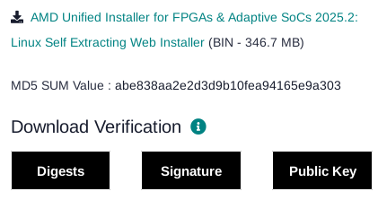
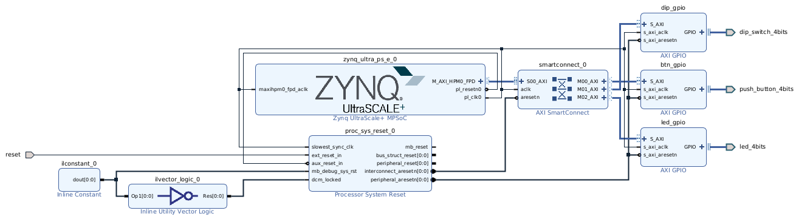
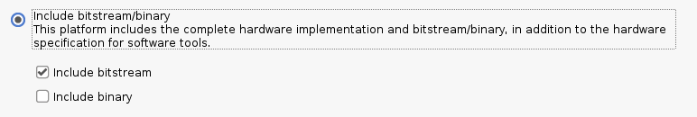
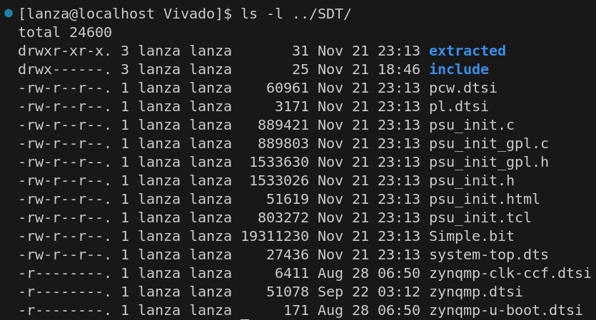
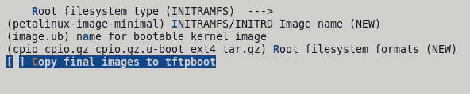
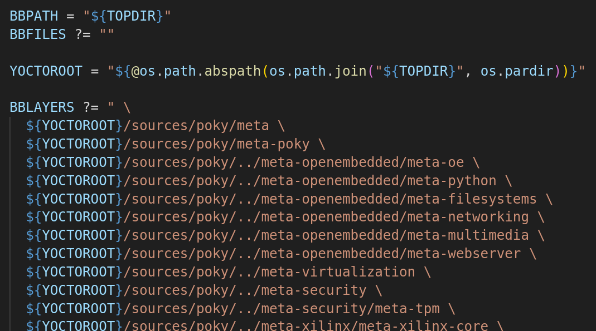
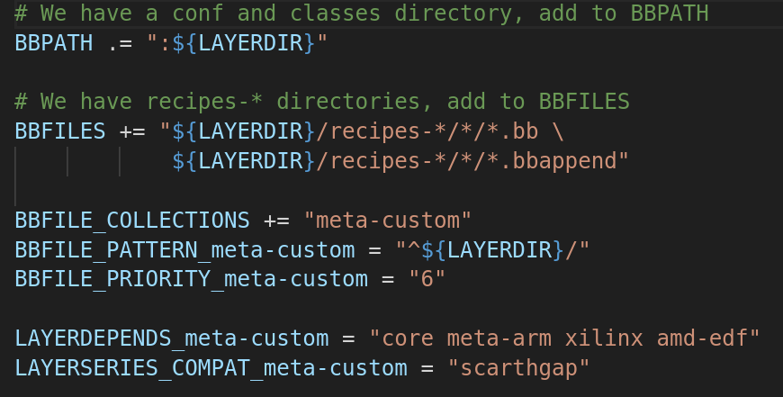

# PetaLinux-to-EDF-Demo
This project will *thoroughly* document transitioning a simple FPGA project from PetaLinux to the EDF (Yocto flow) **from start to finish**.

## Overview

- Project Version: 2025.2
- OS Version: Alma Linux 9.7
- Yocto Upstream Version: Scarthgap LTS (v5.0)
- FPGA: [ZCU104 Dev Board](https://www.amd.com/en/products/adaptive-socs-and-fpgas/evaluation-boards/zcu104.html)

## Installation

- Dependency Installs
    - `gsettings set org.gnome.desktop.wm.preferences button-layout ":minimize,maximize,close"`
    - `sudo dnf update`
    - `sudo dnf install epel-release dnf-plugins-core`
    - `sudo dnf config-manager --set-enabled crb`
    - `sudo dnf makecache`
    - `sudo dnf install autoconf automake bzip2 ccache chrpath cpio cpp diffstat diffutils gawk gcc gcc-c++ git glib2-devel glibc-devel glibc-langpack-en glibc-locale-source gzip latexmk libacl librsvg2-tools libtool lz4 make ncurses ncurses-devel openssl openssl-devel patch perl perl-Data-Dumper perl-Text-ParseWords perl-Thread-Queue python3 python3-GitPython python3-jinja2 python3-pexpect python3-pip repo rpcgen socat tar texinfo texlive-collection-fontsrecommended texlive-collection-latex texlive-collection-latexrecommended texlive-collection-xetex texlive-fncychap texlive-gnu-freefont texlive-tex-gyre texlive-xetex uboot-tools unzip wget which xterm xz zlib zlib-devel zstd`
    - `sudo pip3 install sphinx sphinx_rtd_theme pyyaml`
    - `localectl`
        - Locale should be set to "LANG=en_US.UTF-8"
        - In case if it's not: `sudo localectl set-locale LANGE=en_US.UTF-8`

- Vivado Install
    - Go to [Vivado Downloads](https://www.xilinx.com/support/download.html)
        - 
    - `chmod +x ~/Downloads/FPGAs_AdaptiveSoCs_Unified_SDI_2025.2_1114_2157_Lin64.bin`
    - Install Vivado with the Self Extracting Installer
        - **Warning: AMD Account Required!!!**
    - Vivado is installed under: */opt/Xilinx/2025.2/Vivado*

- Optional: Visual Studio Code
    - `sudo rpm --import https://packages.microsoft.com/keys/microsoft.asc`
    - `echo -e "[code]\nname=Visual Studio Code\nbaseurl=https://packages.microsoft.com/yumrepos/vscode\nenabled=1\nautorefresh=1\ntype=rpm-md\ngpgcheck=1\ngpgkey=https://packages.microsoft.com/keys/microsoft.asc" | sudo tee /etc/yum.repos.d/vscode.repo > /dev/null`
    - `dnf check-update`
    - `sudo dnf install code`
    - Extensions
        - C/C++
        - Makefile Tools
        - Python
        - Bash IDE
        - Embedded Linux Kernel Dev
        - Yocto Project BitBake
        - Verilog-HDL

## Vivado

After installing everything I need, I'm going to start with the PL design using Vivado. The PL design will be pretty simple. It will feature 3 AXI GPIO blocks: one for the 4 push buttons, one for the DIP switches, and one for the 4 LEDs.

After generating the bitstream, I exported the hardware platform.

After generating the XSA, I created the System Device Tree (SDT) using `SDTGen`.

- `sdtgen`
- `set_dt_param -dir ../SDT -xsa ../XSA/Simple.xsa`
- `generate_sdt`
- `exit`

This is what the generated SDT looks like:

**TODO: I would like for there to be a script to automate the SDT generation process**

## Yocto (EDF)

After creating the simple Vivado design, I'm moving onto the new EDF flow. **For this flow, I need to create an INITRAMFS image, meaning that the image will only run off of the FPGA's volatile memory.** This image, on bootup, will start a `systemd` service. This service will utilize another custom application that will read/write to the GPIO IPs via AXI. I will use the [2025.1 branch](https://github.com/Dishoungh/PetaLinux-to-EDF-Demo/tree/2025.1) for reference. 

In the 2025.1 version on PetaLinux, I configured the project to set the image type as INITRAMFS. 

This will have the build generate an `image.ub` FIT image, which is an image file that combines the rootfs as a CPIO archive, the compressed kernel image, and the device tree blob. With this, I can either boot from an SD card or from built-in NOR flash memory with BOOT.BIN, boot.scr, and image.ub files. **The goal of this project is to replicate our PetaLinux flow in the EDF flow!**

### Getting Started

To start:
- `cd ./Yocto`
- `repo init -u https://github.com/Xilinx/yocto-manifests.git -b rel-v2025.2 -m default-edf.xml`
- `repo sync`
- `source ./edf-init-build-env`

I removed the .git folders from the manifests. Yes, I know I'm not supposed to do this, but I don't care lol.

### Creating Custom Layer

Next, I need to create my own layer to put stuff I'm going to place in my Linux image for my FPGA.

- `bitbake-layers create-layer ../sources/meta-custom`
- `bitbake-layers add-layer ../sources/meta-custom`

I need to modify the bblayers.conf. By default, Yocto uses absolute paths which can be annoying when uploading Yocto projects to something like GitLab and different machines need to develop these projects.

Yes, I know Yocto is not designed like this and I'm supposed to push changes to images on a remote sit (GitHub/GitLab/etc), but I'm not going to do it this way. Instead, I need to host the whole Yocto project except for the temporary build stuff of course.

### SDT Import

After creating my custom layer, I edit the layer.conf to add dependencies and import the SDT:

- `rm -rfv ../sources/meta-custom/recipes-example/`
- `vim ../sources/meta-custom/conf/layer.conf`

- `gen-machine-conf parse-sdt --hw-description ../../SDT --machine-name arty-z7 --config-dir ../sources/meta-custom/conf/`
    - Set `MACHINE = "arty-z7"` in *local.conf*

### Project Configuration

I put image settings and other things at the bottom of my *local.conf*

### U-Boot Configuration

- `bitbake virtual/bootloader -c menuconfig`
- `bitbake virtual/bootloader -c diffconfig`
- `cat ./tmp/work/arty_z7-amd-linux-gnueabi/u-boot-xlnx/2025.01-xilinx-v2025.1+git/fragment.cfg >> ../sources/meta-custom/recipes-bsp/u-boot/files/u-boot.cfg`
- `bitbake virtual/bootloader -c cleansstate`

### Kernel Configuration

- `bitbake virtual/kernel -c menuconfig`
- `bitbake virtual/kernel -c diffconfig`
- `cat ./tmp/work/arty_z7-amd-linux-gnueabi/linux-xlnx/6.12.10+git/fragment.cfg >> ../sources/meta-custom/recipes-kernel/linux/files/kernel.cfg`
- `bitbake virtual/kernel -c cleansstate`

### Device Tree Configuration

Fortunately, since we used the SDT flow, our reference device tree is already made in the SDT folder we exported to from Vivado.

### Building and Packaging Project

- Run `build-script.sh`
    - Script calls `bitbake petalinux-image-minimal`
    - Copies BOOT-arty-z7.bin as BOOT.BIN into *deployed-images*
    - Copies boot.scr into *deployed-images*
    - Copies fitImage as image.ub into *deployed-images*
    - Copies system.dtb into *deployed-images*

*To debloat image, look into Manifest file and use "IMAGE_INSTALL:remove"*

### Boot Process

- Copy BOOT.BIN, boot.scr, and image.ub to SD card

**Image boot is successful!!!**