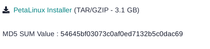
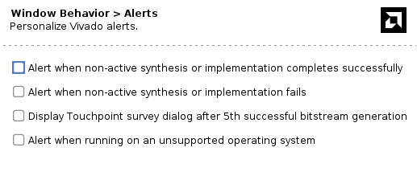
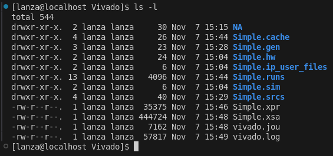
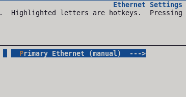
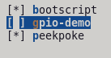
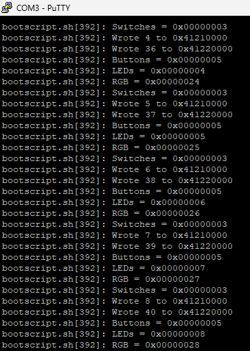

# PetaLinux-to-EDF-Demo
This project will document transitioning a simple FPGA project from PetaLinux to a more native Yocto flow (**start to finish**).

## Overview

- Project Version: 2025.1
- OS Version: Alma Linux 9.6
- Yocto Upstream Version: Scarthgap LTS (v5.0)
- FPGA: [Digilent Arty Z7-20](https://digilent.com/shop/arty-z7-zynq-7000-soc-development-board/)

## Installation

- Dependency Installs
    - `gsettings set org.gnome.desktop.wm.preferences button-layout ":minimize,maximize,close"`
    - `sudo dnf update`
    - `sudo dnf install epel-release dnf-plugins-core`
    - `sudo dnf config-manager --set-enabled crb`
    - `sudo dnf makecache`
    - `sudo dnf install autoconf automake bzip2 ccache chrpath cpio cpp diffstat diffutils gawk gcc gcc-c++ git glib2-devel glibc-devel glibc-langpack-en glibc-locale-source gzip latexmk libacl librsvg2-tools libtool lz4 make ncurses ncurses-devel openssl openssl-devel patch perl perl-Data-Dumper perl-Text-ParseWords perl-Thread-Queue python3 python3-GitPython python3-jinja2 python3-pexpect python3-pip repo rpcgen socat tar texinfo texlive-collection-fontsrecommended texlive-collection-latex texlive-collection-latexrecommended texlive-collection-xetex texlive-fncychap texlive-gnu-freefont texlive-tex-gyre texlive-xetex uboot-tools unzip wget which xterm xz zlib zlib-devel zstd`
    - `sudo pip3 install sphinx sphinx_rtd_theme pyyaml`
    - `localectl`
        - Locale should be set to "LANG=en_US.UTF-8"
        - In case if it's not: `sudo localectl set-locale LANGE=en_US.UTF-8`

- Vivado Install
    - Go to [Vivado Downloads](https://www.xilinx.com/support/download.html)
        - 
    - `chmod +x ~/Downloads/FPGAs_AdaptiveSoCs_Unified_SDI_2025.1_0530_0145_Lin64.bin`
    - Install Vivado with the Self Extracting Installer
        - **Warning: AMD Account Required!!!**
    - Vivado is installed under: */opt/Xilinx/2025.1/Vivado*

- PetaLinux Install
    - Go to [Embedded Software](https://www.xilinx.com/support/download/index.html/content/xilinx/en/downloadNav/embedded-design-tools.html)
        - 
    - `chmod +x ~/Downloads/petalinux-v2025.1-05180714-installer.run`
    - Install PetaLinux with the dedicated Installer
        - **Warning: AMD Account Required!!!**
    - `sudo mkdir -p /opt/Xilinx/2025.1/PetaLinux`
    - `sudo chown -R $USER:$USER /opt/Xilinx/2025.1/PetaLinux`
    - `~/Downloads/petalinux-v2025.1-05180714-installer.run -d /opt/Xilinx/2025.1/PetaLinux/`

- Optional: Visual Studio Code
    - `sudo rpm --import https://packages.microsoft.com/keys/microsoft.asc`
    - `echo -e "[code]\nname=Visual Studio Code\nbaseurl=https://packages.microsoft.com/yumrepos/vscode\nenabled=1\nautorefresh=1\ntype=rpm-md\ngpgcheck=1\ngpgkey=https://packages.microsoft.com/keys/microsoft.asc" | sudo tee /etc/yum.repos.d/vscode.repo > /dev/null`
    - `dnf check-update`
    - `sudo dnf install code`
    - Extensions
        - C/C++
        - Makefile Tools
        - Python
        - Base IDE
        - Embedded Linux Kernel Dev
        - Yocto Project BitBake
        - Verilog-HDL

## Vivado

After installing everything I need, I'm going to start with the PL design using Vivado. The PL design will be pretty simple. It will feature 3 AXI GPIO blocks: one for the 4 push buttons, one for the 2 DIP switches, and one for the 4 LEDs.

For some reason, Vivado tries to request screen sharing when I compile. To stop this, I had to disable the alerts (Settings --> Tool Settings --> Window Behavior --> Alerts):

After generating the bitstream, I exported the hardware platform.

After generating the XSA, I created the System Device Tree (SDT) using `SDTGen`.

- `sdtgen`
- `set_dt_param -dir ../SDT -xsa ./Simple.xsa`
- `generate_sdt`
- `exit`

This is what the generated SDT looks like:

**TODO: I would like for there to be a script to automate the SDT generation process**

## PetaLinux SDK

After creating the simple Vivado design, I'm going to create an **INITRAMFS-based** image that will start a `systemd`-style initscript. This initscript will use `peekpoke`, which is an application that reads/writes to memory-mapped devices (AXI GPIO). We will use this to control the board's peripherals via GPIO.

First, I create the project:

- `petalinux-create project --template zynq --name PetaLinux-SDK`

Next, I import the SDT into the PetaLinux project:

- `petalinux-config --get-hw-description ../SDT/`
    - Ethernet Settings
        - Set it to manual since I want finer control over how the ethernet will be set up
        - 
    - Image Packaging Settings
        - This will be an INITRAMFS image
        - 

After setting up the PetaLinux project, I create the initscript:

- `petalinux-create --type apps --name bootscript --enable`
- `petalinux-config -c rootfs`
    - 

I've never made a systemd script before and I want to learn to make one just for future reference. What I want to do in this script:

- Initialize Ethernet
- Mount SD Card
- In a loop:
    - Read Button GPIO: `peek 0x41200000`
    - Read LEDs GPIO: `peek 0x41210000`
    - Read RGB GPIO: `peek 0x41220000`
    - Read Switch GPIO: `peek 0x41230000`
    - Increment LED Value
    - Increment RGB Value
    - Write LED Value to LEDs GPIO: `poke 0x41210000 (VAL)`
    - Write RGB Value to RGB GPIO: `poke 0x41220000 (VAL)`

*My bootscript is located: PetaLinux-SDK/project-spec/meta-user/recipes-apps/bootscript*

To build and package the project:
- `petalinux-build`
- `bootgen -arch zynq -image ./bootgen.bif -o ./images/linux/BOOT.BIN -w`

My bootscript output looks like this:

## Yocto (PetaLinux)

**TBD**

## Yocto (EDF)

**TBD**